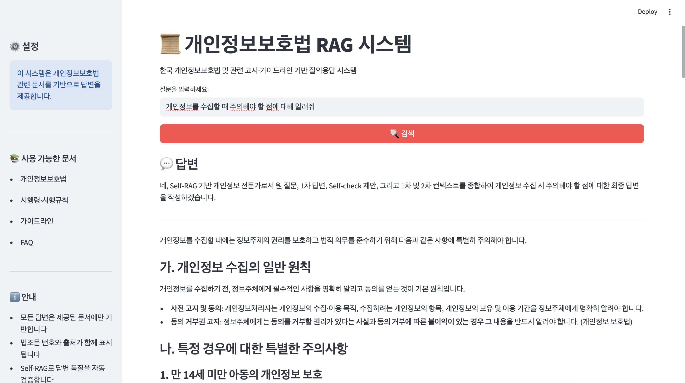

# 개인정보보호법 RAG 시스템

한국 개인정보보호법 및 관련 고시·가이드라인 기반 질의응답 시스템입니다.

## 기능

- **하이브리드 검색**: Dense (벡터) + Sparse (BM25) 검색
- **구조 인식 청킹**: 법률 문서의 조문 구조를 존중한 청킹
- **Self-RAG**: 답변 검증 및 자동 수정 기능
- **FastAPI 서버**: RESTful API 제공

## 설치

### 방법 1: uv 사용 (권장)

```bash
# uv 설치 (아직 설치하지 않은 경우)
curl -LsSf https://astral.sh/uv/install.sh | sh
source $HOME/.local/bin/env  # 또는 셸 재시작

# 프로젝트 초기화 및 의존성 설치
uv sync

# 환경 변수 설정
export GOOGLE_API_KEY="your-api-key-here"
```

### 방법 2: pip3 사용

```bash
# 가상환경 생성 (선택사항)
python3 -m venv venv
source venv/bin/activate  # Windows: venv\Scripts\activate

# 의존성 설치
pip3 install -r requirements.txt

# 환경 변수 설정
export GOOGLE_API_KEY="your-api-key-here"
```

**참고**: macOS에서는 `pip` 대신 `pip3`를 사용해야 할 수 있습니다.

## 사용법

### 1. 데이터 준비

PDF 파일을 다음 디렉토리에 배치하세요:

```
data/
  raw/
    law/          # 법률, 시행령, 시행규칙
      *.pdf
    guides/       # 가이드라인, FAQ, 해설서
      *.pdf
```

### 2. 인덱스 구축

```bash
# uv를 사용한 경우
uv run python -m src.ingestion.build_index

# 또는 pip3를 사용한 경우
python3 -m src.ingestion.build_index
```

이 명령은 다음을 수행합니다:
- PDF 파일 로드
- 전처리 및 구조 인식 청킹
- 벡터 스토어 (Chroma) 구축
- BM25 인덱스 구축

### 3. 웹 UI 실행 (권장)

```bash
# Streamlit UI 실행
streamlit run src/ui/app.py

# 또는
python3 -m streamlit run src/ui/app.py
```

웹 브라우저에서 `http://localhost:8501`로 접속하면 됩니다.

### 4. API 서버 실행 (선택사항)

```bash
# uv를 사용한 경우
uv run uvicorn src.api.server:app --reload

# 또는 pip3를 사용한 경우
python3 -m uvicorn src.api.server:app --reload
```

서버가 `http://localhost:8000`에서 실행됩니다.

### 5. 쿼리 테스트

#### API를 통한 테스트

```bash
curl -X POST "http://localhost:8000/query" \
  -H "Content-Type: application/json" \
  -d '{"question": "개인정보 보유기간은 얼마나 되나요?"}'
```

#### 평가 스크립트 실행

```bash
# uv를 사용한 경우
uv run python -m src.eval.evaluate

# 또는 pip3를 사용한 경우
python3 -m src.eval.evaluate
```

## 프로젝트 구조

```
src/
  config.py              # 설정
  prompts.py             # 프롬프트 정의
  ingestion/             # 데이터 수집
    loader.py
    preprocessing.py
    chunking.py
    build_index.py
  retrieval/             # 검색
    retriever.py
  rag/                   # RAG 체인
    chains.py
    self_rag.py
  api/                   # API 서버
    server.py
  eval/                  # 평가
    test_cases.py
    evaluate.py
```

## 주요 설정

`src/config.py`에서 다음을 설정할 수 있습니다:

- `CHUNK_SIZE`: 청크 크기 (기본: 1000)
- `CHUNK_OVERLAP`: 청크 간 겹침 (기본: 200)
- `TOP_K_RETRIEVAL`: 검색 문서 수 (기본: 8)
- `DENSE_WEIGHT`: Dense 검색 가중치 (기본: 0.6)
- `SPARSE_WEIGHT`: BM25 검색 가중치 (기본: 0.4)
- `LLM_MODEL`: 사용할 LLM 모델 (기본: gemini-1.5-flash)

## 참고사항

- 모든 PDF는 텍스트 추출 가능해야 합니다 (OCR 미지원).
- Google Gemini API 키가 필요합니다. [Google AI Studio](https://makersuite.google.com/app/apikey)에서 발급받을 수 있습니다.
- 벡터 스토어는 `data/chroma/`에 저장됩니다.
- BM25 인덱스는 `data/index/bm25_index.pkl`에 저장됩니다.
- 기본 LLM 모델은 `gemini-1.5-flash`이며, `src/config.py`에서 변경할 수 있습니다.

## 실행 예시


